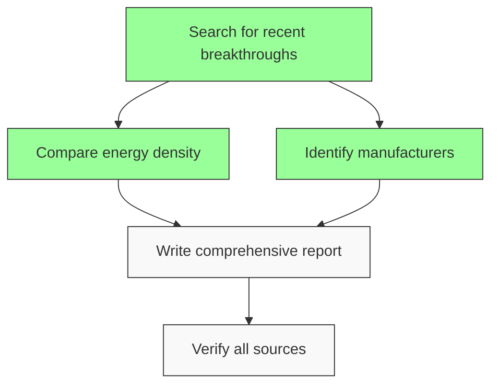

# Building a Full-Fledged Task Decomposition System for MR-BOT

Based on my analysis of your current implementation, you already have a solid foundation with progress tracking, but we can significantly enhance the task decomposition capabilities. Here's how to build a complete system from scratch:

## Current State Analysis

Your current system already has:
1. Markdown checklist-based progress tracking
2. `taskProgress` parameter in all tool calls
3. Progress state management with atomic merging
4. History tracking and validation
5. Event system for progress updates

## Enhanced Task Decomposition System Design

### 1. Task Graph Representation (DAG)

First, let's implement a proper Directed Acyclic Graph (DAG) structure for tasks:

```javascript
class TaskNode {
  constructor(id, description, dependencies = []) {
    this.id = id;
    this.description = description;
    this.dependencies = dependencies; // Array of task IDs this depends on
    this.status = 'pending'; // pending, in-progress, completed, failed
    this.result = null;
    this.requiredTools = []; // Tools needed for this task
    this.estimatedDuration = null;
    this.priority = 1; // 1-5 scale
  }
}

class TaskGraph {
  constructor() {
    this.nodes = new Map(); // id -> TaskNode
    this.roots = []; // Tasks with no dependencies
    this.leaves = []; // Tasks with no dependents
  }

  addTask(id, description, dependencies = []) {
    const node = new TaskNode(id, description, dependencies);
    this.nodes.set(id, node);

    // Update graph structure
    if (dependencies.length === 0) {
      this.roots.push(id);
    }

    // Update dependencies' dependents
    for (const depId of dependencies) {
      if (!this.nodes.has(depId)) {
        throw new Error(`Dependency ${depId} not found`);
      }
      // In a full implementation, we'd track dependents
    }

    return node;
  }

  // Topological sort for execution order
  getExecutionOrder() {
    const visited = new Set();
    const result = [];

    const visit = (nodeId) => {
      if (visited.has(nodeId)) return;
      const node = this.nodes.get(nodeId);

      // Visit all dependencies first
      for (const depId of node.dependencies) {
        visit(depId);
      }

      visited.add(nodeId);
      result.push(nodeId);
    };

    // Start from all roots
    for (const rootId of this.roots) {
      visit(rootId);
    }

    return result;
  }

  // Convert to markdown checklist format
  toMarkdown() {
    const executionOrder = this.getExecutionOrder();
    return executionOrder.map(id => {
      const node = this.nodes.get(id);
      const status = node.status === 'completed' ? 'x' : ' ';
      return `- [${status}] ${node.description}`;
    }).join('\n');
  }
}
```

### 2. Enhanced Agent Class with Task Decomposition

Let's extend your Agent class with proper task decomposition:

```javascript
// Add to Agent class constructor
this.taskGraph = null;
this.currentTaskContext = null;

// New method for task decomposition
async decomposeTask(broadObjective) {
  // Step 1: Analyze the objective
  const analysis = await this._analyzeObjective(broadObjective);

  // Step 2: Generate task graph
  this.taskGraph = await this._generateTaskGraph(analysis);

  // Step 3: Validate the plan
  await this._validatePlan(this.taskGraph);

  // Step 4: Convert to progress tracking format
  this.currentProgress = this.taskGraph.toMarkdown();

  return this.taskGraph;
}

async _analyzeObjective(objective) {
  // Use LLM to analyze the objective and suggest sub-tasks
  const response = await this.client.chat.complete({
    model: this.model,
    messages: [
      {
        role: "system",
        content: `You are a task decomposition expert. Analyze the following objective and break it down into logical sub-tasks with dependencies.

        Objective: ${objective}

        Respond with JSON in this format:
        {
          "subTasks": [
            {
              "id": "unique-identifier",
              "description": "Clear task description",
              "dependencies": ["id1", "id2"], // optional
              "requiredTools": ["tool1", "tool2"], // optional
              "notes": "Any additional context" // optional
            }
          ],
          "potentialRisks": ["risk1", "risk2"],
          "suggestedApproach": "brief explanation"
        }`
      }
    ]
  });

  return JSON.parse(response.choices[0].message.content);
}

async _generateTaskGraph(analysis) {
  const graph = new TaskGraph();

  // Add all tasks to the graph
  for (const task of analysis.subTasks) {
    graph.addTask(task.id, task.description, task.dependencies || []);

    // Store additional metadata
    const node = graph.nodes.get(task.id);
    node.requiredTools = task.requiredTools || [];
    // Add other properties as needed
  }

  return graph;
}

async _validatePlan(graph) {
  // Check for cycles
  try {
    graph.getExecutionOrder();
  } catch (e) {
    throw new Error("Circular dependencies detected in task plan");
  }

  // Check all dependencies exist
  for (const [id, node] of graph.nodes) {
    for (const depId of node.dependencies) {
      if (!graph.nodes.has(depId)) {
        throw new Error(`Task ${id} depends on non-existent task ${depId}`);
      }
    }
  }

  // Check required tools are available
  for (const [id, node] of graph.nodes) {
    for (const tool of node.requiredTools) {
      if (!this.tools.some(t => t.function.name === tool)) {
        console.warn(`Warning: Task ${id} requires tool ${tool} which is not available`);
      }
    }
  }
}
```

### 3. Execution with Dependency Tracking

Modify the execute method to handle the task graph:

```javascript
async executeWithPlan(history, userInput) {
  // If we don't have a plan yet, create one
  if (!this.taskGraph) {
    await this.decomposeTask(userInput);
  }

  // Get next executable tasks
  const executionOrder = this.taskGraph.getExecutionOrder();
  const pendingTasks = executionOrder.filter(id => {
    const node = this.taskGraph.nodes.get(id);
    return node.status === 'pending' &&
           node.dependencies.every(depId =>
             this.taskGraph.nodes.get(depId).status === 'completed');
  });

  if (pendingTasks.length === 0) {
    // All tasks completed or no executable tasks
    if (executionOrder.every(id => this.taskGraph.nodes.get(id).status === 'completed')) {
      return { response: "All tasks completed successfully!", fullMessages: history };
    } else {
      return { response: "No executable tasks available. Some dependencies may have failed.", fullMessages: history };
    }
  }

  // Focus on the next executable task
  const nextTaskId = pendingTasks[0];
  const nextTask = this.taskGraph.nodes.get(nextTaskId);

  // Update progress
  nextTask.status = 'in-progress';
  this.currentProgress = this.taskGraph.toMarkdown();
  this.updateProgress(this.currentProgress, 'system', 'task-started');

  // Create prompt focusing on this specific task
  const taskPrompt = `
  Current Task: ${nextTask.description}

  Context:
  - This is part of a larger objective: [original objective]
  - Dependencies: ${nextTask.dependencies.join(', ') || 'None'}
  - Required tools: ${nextTask.requiredTools.join(', ') || 'None'}

  Instructions:
  1. Focus ONLY on completing this specific task
  2. Use the required tools if needed
  3. When completed, mark this task as done in your taskProgress
  4. If you can't complete it, explain why and suggest alternatives
  5. Include the complete updated task list in every response
  `;

  const messages = [
    { role: "system", content: this.systemPrompt },
    ...(history || []),
    { role: "user", content: taskPrompt }
  ];

  const response = await this.client.chat.complete({
    model: this.model,
    messages: messages,
    ...(this.tools.length > 0 && { tools: this.toolManager.getApiTools() })
  });

  return this.responseProcessor.processResponse(response, messages);
}
```

### 4. Integration with Existing Progress Tracking

The new system integrates seamlessly with your existing progress tracking:

1. The `TaskGraph.toMarkdown()` method generates the checklist format you already use
2. Task status updates automatically update the progress state
3. All existing progress validation and merging continues to work
4. The event system remains unchanged

### 5. Visualization Examples

Add this method to your TaskGraph class for visualization:

```javascript
generateMermaidDiagram() {
  let diagram = 'graph TD;\n';

  // Add all nodes
  for (const [id, node] of this.nodes) {
    let shape = 'rectangle';
    let style = '';

    if (node.status === 'completed') {
      style = 'fill:#9f9,stroke:#393';
    } else if (node.status === 'failed') {
      style = 'fill:#f99,stroke:#933';
    } else if (node.status === 'in-progress') {
      style = 'fill:#99f,stroke:#339';
    }

    diagram += `  ${id}["${node.description}"];${style ? `:::${style}` : ''}\n`;
  }

  // Add all edges
  for (const [id, node] of this.nodes) {
    for (const depId of node.dependencies) {
      diagram += `  ${depId} --> ${id};\n`;
    }
  }

  // Add legend
  diagram += '\n  classDef default fill:#f9f9f9,stroke:#333;\n';
  diagram += '  classDef completed fill:#9f9,stroke:#333;\n';
  diagram += '  classDef failed fill:#f99,stroke:#333;\n';
  diagram += '  classDef inprogress fill:#99f,stroke:#333;';

  return diagram;
}
```

### 6. Complete Example Workflow

Here's how it would work for your example of "Research and write a report on solid-state battery tech":

1. **Initial Decomposition**:
```json
{
  "subTasks": [
    {
      "id": "research-breakthroughs",
      "description": "Search for recent breakthroughs in solid-state battery tech (2024-2025)",
      "requiredTools": ["searchWeb"],
      "dependencies": []
    },
    {
      "id": "compare-energy-density",
      "description": "Compare energy density of solid-state vs lithium-ion batteries",
      "requiredTools": ["calculatorTool", "searchWeb"],
      "dependencies": ["research-breakthroughs"]
    },
    {
      "id": "find-manufacturers",
      "description": "Identify leading manufacturers and their commercialization timelines",
      "requiredTools": ["searchWeb"],
      "dependencies": ["research-breakthroughs"]
    },
    {
      "id": "synthesize-findings",
      "description": "Write comprehensive report in Markdown format",
      "requiredTools": ["fileSystem"],
      "dependencies": ["compare-energy-density", "find-manufacturers"]
    },
    {
      "id": "validate-sources",
      "description": "Verify all sources and citations",
      "requiredTools": ["searchWeb"],
      "dependencies": ["synthesize-findings"]
    }
  ],
  "potentialRisks": [
    "Outdated information in search results",
    "Conflicting data between sources",
    "Missing key manufacturers"
  ]
}
```

2. **Execution Flow**:
- System starts with "research-breakthroughs" (no dependencies)
- After completion, both "compare-energy-density" and "find-manufacturers" become executable
- These can run in parallel (your existing parallel tool execution handles this)
- After both complete, "synthesize-findings" becomes executable
- Finally, "validate-sources" runs

3. **Progress Tracking**:
```
- [x] Search for recent breakthroughs in solid-state battery tech (2024-2025)
- [x] Compare energy density of solid-state vs lithium-ion batteries
- [x] Identify leading manufacturers and their commercialization timelines
- [ ] Write comprehensive report in Markdown format
- [ ] Verify all sources and citations
```

4. **Visualization** (Mermaid diagram):


### 7. Integration with Existing Components

The new system works with your existing components:

1. **CircuitBreaker**: Still protects tool executions
2. **LoopDetector**: Still prevents infinite loops
3. **ToolManager**: Handles all tool executions as before
4. **Progress Tracking**: Uses the same markdown format
5. **Event System**: All existing events still fire

### 8. Implementation Plan

To implement this in your project:

1. Create the `TaskNode` and `TaskGraph` classes in a new file `src/TaskGraph.js`
2. Add the decomposition methods to your `Agent.js` class
3. Add the `executeWithPlan` method as an alternative to `execute`
4. Update your system prompt to include instructions about the new task decomposition protocol
5. Add visualization methods to generate Mermaid diagrams

### 9. Example System Prompt Addition

Add this to your system prompt:

```
## Enhanced Task Decomposition Protocol

When you receive a complex objective:

1. **ANALYZE FIRST**: Break down the objective into logical sub-tasks with dependencies
2. **FOCUS ON ONE TASK**: Only work on tasks that have all dependencies completed
3. **TRACK PROGRESS**: Include the complete updated task list in every response using taskProgress
4. **HANDLE BLOCKERS**: If a task can't be completed, explain why and suggest alternatives
5. **VALIDATE RESULTS**: After completing tasks, verify they meet the requirements

Task list format requirements:
- Use the exact task descriptions provided
- Mark tasks as completed ONLY when fully finished
- Include all tasks in every update, not just the changed ones
- Maintain the original task order when possible

When all tasks are completed, provide a final summary of results.
```

## Key Benefits of This Approach

1. **Structured Execution**: Clear dependencies ensure tasks are completed in the right order
2. **Parallel Execution**: Independent tasks can run concurrently
3. **Progress Visibility**: Clear tracking of what's done and what's remaining
4. **Error Resilience**: Failed tasks can be retried without affecting completed dependencies
5. **Visualization**: Easy to understand task relationships and progress
6. **Integration**: Works seamlessly with your existing components

Would you like me to elaborate on any specific part of this implementation or provide more detailed code examples for particular components? I can also suggest how to integrate this with your existing circuit breaker and loop detection systems for even more robust operation.

# Enhanced Task Decomposition Implementation Plan for MR-BOT

Gemini's feedback is excellent and aligns perfectly with our architecture. Let me refine the implementation plan incorporating these insights and address the key questions.

## Refined Architecture with Gemini's Recommendations

### 1. Dynamic Plan Mutation Implementation

I'll add these methods to the `TaskGraph` class to handle runtime plan adjustments:

```javascript
class TaskGraph {
  // ... existing methods ...

  /**
   * Dynamically add/update tasks in the graph
   * @param {Array} newTasks - Array of task objects with id, description, dependencies
   * @param {Object} context - Current execution context
   */
  updateGraph(newTasks, context) {
    // Validate new tasks don't create cycles
    const testGraph = new TaskGraph();
    // Clone current state
    for (const [id, node] of this.nodes) {
      testGraph.addTask(id, node.description, node.dependencies);
    }

    // Try adding new tasks
    for (const task of newTasks) {
      try {
        testGraph.addTask(task.id, task.description, task.dependencies);
      } catch (e) {
        throw new Error(`Cannot add task ${task.id}: ${e.message}`);
      }
    }

    // If validation passes, apply to real graph
    for (const task of newTasks) {
      if (this.nodes.has(task.id)) {
        // Update existing task
        const node = this.nodes.get(task.id);
        node.description = task.description;
        node.dependencies = task.dependencies;
        // Preserve status unless explicitly changed
        if (task.status) node.status = task.status;
      } else {
        // Add new task
        this.addTask(task.id, task.description, task.dependencies);
      }
    }

    // Recalculate roots and leaves
    this._recalculateGraphProperties();
  }

  /**
   * Handle task failure with recovery options
   * @param {string} taskId - Failed task ID
   * @param {string} reason - Failure reason
   * @param {Array} recoveryOptions - Alternative approaches
   */
  handleTaskFailure(taskId, reason, recoveryOptions = []) {
    const node = this.nodes.get(taskId);
    if (!node) throw new Error(`Task ${taskId} not found`);

    node.status = 'failed';
    node.failureReason = reason;

    // Add recovery tasks if provided
    if (recoveryOptions.length > 0) {
      for (let i = 0; i < recoveryOptions.length; i++) {
        const recoveryTaskId = `${taskId}_recovery_${i}`;
        this.addTask(
          recoveryTaskId,
          recoveryOptions[i].description,
          recoveryOptions[i].dependencies || []
        );

        // Replace original task dependency with recovery task
        for (const [id, dependentNode] of this.nodes) {
          if (dependentNode.dependencies.includes(taskId)) {
            dependentNode.dependencies = dependentNode.dependencies
              .filter(dep => dep !== taskId)
              .concat(recoveryTaskId);
          }
        }
      }
    }

    this._recalculateGraphProperties();
  }

  _recalculateGraphProperties() {
    // Recalculate roots (tasks with no dependencies)
    this.roots = Array.from(this.nodes.entries())
      .filter(([_, node]) => node.dependencies.length === 0)
      .map(([id]) => id);

    // Recalculate leaves (tasks that nothing depends on)
    const allDependencies = new Set();
    for (const [_, node] of this.nodes) {
      node.dependencies.forEach(dep => allDependencies.add(dep));
    }

    this.leaves = Array.from(this.nodes.keys())
      .filter(id => !allDependencies.has(id));
  }
}
```

### 2. State Persistence Implementation

Add these methods to `TaskGraph` for serialization:

```javascript
class TaskGraph {
  // ... existing methods ...

  toJSON() {
    return {
      version: '1.0',
      nodes: Array.from(this.nodes.entries()).map(([id, node]) => ({
        id,
        description: node.description,
        dependencies: node.dependencies,
        status: node.status,
        result: node.result,
        failureReason: node.failureReason,
        requiredTools: node.requiredTools,
        priority: node.priority
      })),
      roots: this.roots,
      leaves: this.leaves
    };
  }

  static fromJSON(json) {
    const graph = new TaskGraph();
    if (json.version !== '1.0') {
      throw new Error(`Unsupported graph version: ${json.version}`);
    }

    // First pass: create all nodes
    for (const nodeData of json.nodes) {
      const node = new TaskNode(
        nodeData.id,
        nodeData.description,
        nodeData.dependencies
      );
      node.status = nodeData.status;
      node.result = nodeData.result;
      node.failureReason = nodeData.failureReason;
      node.requiredTools = nodeData.requiredTools;
      node.priority = nodeData.priority;
      graph.nodes.set(nodeData.id, node);
    }

    // Second pass: set roots and leaves
    graph.roots = json.roots;
    graph.leaves = json.leaves;

    return graph;
  }
}
```

### 3. Context Window Optimization

Modify the task prompt generation to be more efficient:

```javascript
// In Agent class
async _generateTaskPrompt(taskId) {
  const node = this.taskGraph.nodes.get(taskId);
  if (!node) throw new Error(`Task ${taskId} not found`);

  // Get only direct dependencies' results
  const dependencyContext = [];
  for (const depId of node.dependencies) {
    const depNode = this.taskGraph.nodes.get(depId);
    if (depNode.result) {
      dependencyContext.push(
        `### ${depNode.description}\n` +
        `**Status**: ${depNode.status}\n` +
        `**Result**: ${JSON.stringify(depNode.result)}\n`
      );
    }
  }

  return `
  **Current Task**: ${node.description}
  **Task ID**: ${taskId}

  ${dependencyContext.length > 0 ? `**Dependency Results**:\n${dependencyContext.join('\n')}\n` : ''}

  **Available Tools**: ${node.requiredTools.length > 0 ? node.requiredTools.join(', ') : 'None specified'}

  **Instructions**:
  1. Complete ONLY this specific task
  2. Use the provided dependency results if needed
  3. If you encounter issues:
     - Explain the specific problem
     - Suggest alternative approaches if possible
     - Propose new sub-tasks if the original plan needs adjustment
  4. When completed:
     - Store your result in the 'result' field
     - Mark the task as completed in taskProgress
     - Include the complete updated task list

  **Current Progress**:
  ${this.taskGraph.toMarkdown()}
  `;
}
```

### 4. Failed Node Handling Strategy

For your question about handling failed nodes, I recommend a hybrid approach:

```javascript
// In Agent class
async _handleFailedTask(taskId, error) {
  const node = this.taskGraph.nodes.get(taskId);

  // Generate recovery options using LLM
  const recoveryResponse = await this.client.chat.complete({
    model: this.model,
    messages: [
      {
        role: "system",
        content: `The task "${node.description}" failed with error: ${error.message}.

        Analyze the failure and propose recovery options. Respond with JSON:
        {
          "recoveryOptions": [
            {
              "description": "Clear alternative approach",
              "dependencies": ["dep1", "dep2"],
              "requiredTools": ["tool1"],
              "justification": "Why this might work"
            }
          ],
          "shouldHalt": boolean, // true if human intervention needed
          "recommendation": "brief explanation"
        }`
      }
    ]
  });

  const recoveryPlan = JSON.parse(recoveryResponse.choices[0].message.content);

  if (recoveryPlan.shouldHalt) {
    // Emit event for human intervention
    this.emit('human-intervention-required', {
      taskId,
      error,
      recoveryOptions: recoveryPlan.recoveryOptions,
      recommendation: recoveryPlan.recommendation
    });
    return false;
  } else {
    // Apply automatic recovery
    this.taskGraph.handleTaskFailure(
      taskId,
      error.message,
      recoveryPlan.recoveryOptions
    );
    return true;
  }
}
```

## Implementation Roadmap

Based on Gemini's phased approach and our analysis, here's the updated implementation plan:

### Phase 1: Core Infrastructure (1-2 days)
1. **Create TaskGraph class** (`src/TaskGraph.js`)
   - Basic DAG implementation with topological sort
   - Serialization methods (toJSON/fromJSON)
   - Graph mutation methods
   - Visualization support

2. **Enhance Agent class** (`src/Agent.js`)
   - Add taskGraph property
   - Implement decomposeTask method
   - Add _generateTaskPrompt method
   - Add _handleFailedTask method

3. **Unit Tests**
   - Test circular dependency detection
   - Test serialization/deserialization
   - Test graph mutation scenarios

### Phase 2: System Integration (1-2 days)
4. **Update system prompt** with new protocol
   - Add task decomposition instructions
   - Include failure handling guidelines
   - Add visualization format specifications

5. **Implement executeWithPlan method**
   - Replace existing execute method for planned tasks
   - Add fallback to original execute for simple queries

6. **Connect to storage system**
   - Add task graph serialization to saveHistory
   - Add graph rehydration in loadHistory

### Phase 3: UI/Visualization (1 day)
7. **Add Mermaid visualization**
   - Generate diagrams on demand
   - Update progress tracking display

8. **Enhance event system**
   - Add graph-update events
   - Add task-status-change events

### Phase 4: Testing & Refinement (1-2 days)
9. **Test with sample objectives**
   - Simple 3-task workflow
   - Complex 10+ task workflow
   - Failure scenario testing

10. **Performance optimization**
    - Token usage analysis
    - Execution time benchmarking

## Example Workflow with All Enhancements

For the solid-state battery example with dynamic adjustments:

1. Initial plan creates 5 tasks as before
2. During "research-breakthroughs", agent discovers 3 sub-types
3. Agent calls updateGraph to add:
   - "research-sulfide-batteries"
   - "research-polymer-batteries"
   - "research-oxide-batteries"
4. Original "research-breakthroughs" marked completed
5. New tasks become dependencies for "compare-energy-density"
6. If "research-polymer-batteries" fails:
   - Agent proposes alternative research methods
   - Adds recovery task "research-polymer-alternative"
   - Updates dependencies automatically

## Key Benefits of This Implementation

1. **True Agentic Reasoning**: The DAG structure with dynamic mutation enables genuine multi-step reasoning
2. **Resilience**: Automatic recovery from failures with human fallback
3. **Transparency**: Clear visualization of task relationships and progress
4. **Efficiency**: Optimized context window usage
5. **Persistence**: Robust state management across interruptions
6. **Extensibility**: Easy to add new task types and relationships

## Next Steps

To implement this, I recommend:

1. First toggle to **Act mode** to begin implementation
2. Start with the `TaskGraph` class implementation
3. Then enhance the Agent class with the new methods
4. Finally integrate with your existing systems

Would you like me to provide the complete code for any specific component to get started, or do you have any questions about particular aspects of this implementation plan?