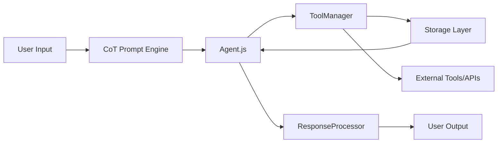
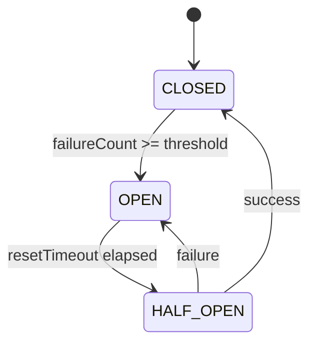

# 🤖 MR-BOT – GitHub-Ready Documentation Package

Below is a complete, production-ready documentation suite for MR-BOT. Copy these files directly into your repository.

---

## 📁 Repository Structure
```
mr-bot/
├── README.md                 # Main entry point (below)
├── package.json
├── src/
│   ├── Agent.js
│   ├── ToolManager.js
│   ├── ResponseProcessor.js
│   └── storage/
├── docs/
│   ├── architecture.md       # System design & data flow
│   ├── safety.md            # Circuit breakers, loop detection, limits
│   ├── limitations.md       # Honest capability boundaries
│   ├── configuration.md     # Storage backends, token limits, prompts
│   └── examples/            # Real-world usage patterns
├── CONTRIBUTING.md          # How to contribute
├── LICENSE
└── .github/
    └── workflows/           # CI/CD templates (optional)
```

---

## 📄 `README.md`

```markdown
# 🤖 MR-BOT

> A reliability-focused orchestration engine for LLM agents

[](LICENSE)
[](https://nodejs.org/)
[](https://www.typescriptlang.org/)
[](https://arxiv.org/)

**MR-BOT** operationalizes Chain-of-Thought (CoT) and ReAct paradigms within a production-ready framework. It enforces structured reasoning, persistent state awareness, and safety controls to build reliable, observable LLM-powered agents.

🔗 [Technical Report](docs/architecture.md) | 📚 [API Docs](docs/) | 🛠 [Examples](docs/examples/)

---

## ✨ Core Features

| Feature | Description |
|---------|-------------|
| 🔁 **Structured Reasoning** | Enforced thought recording via `recordThought` protocol; JSON schema validation for all responses |
| 🧠 **Persistent State** | Map-based `progressState` + flexible backends (MongoDB, JSON, in-memory) |
| 🛡️ **Safety First** | Circuit breakers, loop detection, context limits, max-round enforcement |
| 🔍 **Observability** | Event-driven architecture with detailed logging, progress history, and debug hooks |
| 🔌 **Tool Orchestration** | Parallel/sequential execution, automatic `taskProgress` injection, retry logic |
| ⚙️ **Flexible Deployment** | Swap storage backends, configure token budgets, customize prompts |

---

## 🚀 Quick Start

### Prerequisites
- Node.js ≥ 18
- Mistral AI API key (`MISTRAL_API_KEY`)
- (Optional) MongoDB for persistent state

### Installation
```bash
npm install mr-bot
# or
git clone https://github.com/yourorg/mr-bot.git
cd mr-bot && npm install
```

### Minimal Example
```javascript
import { MRBot } from 'mr-bot';

const bot = new MRBot({
  llm: { provider: 'mistral', model: 'mistral-large-latest' },
  storage: { type: 'memory' }, // or 'mongodb', 'json'
  safety: {
    maxRounds: 10,
    contextLimitTokens: 32000,
    loopDetection: true
  }
});

const result = await bot.run({
  userId: 'user_123',
  input: 'Research AI safety advancements and summarize key points.',
  tools: ['webSearch', 'browserAutomation', 'summarize']
});

console.log(result.output);
console.log(result.progressHistory); // Full reasoning trace
```

### Configuration Snippet (`config.json`)
```json
{
  "llm": {
    "provider": "mistral",
    "model": "mistral-large-latest",
    "temperature": 0.1
  },
  "storage": {
    "type": "mongodb",
    "connectionString": "mongodb://localhost:27017",
    "dbName": "mrbot_prod"
  },
  "safety": {
    "maxRounds": 15,
    "contextLimitTokens": 32000,
    "circuitBreaker": {
      "failureThreshold": 3,
      "resetTimeoutMs": 60000
    },
    "loopDetection": {
      "enabled": true,
      "maxIdenticalSteps": 3
    }
  },
  "observability": {
    "logLevel": "info",
    "emitProgressEvents": true,
    "saveThoughts": true
  }
}
```

---

## 📚 Documentation

| Document | Purpose |
|----------|---------|
| [`docs/architecture.md`](docs/architecture.md) | System components, data flow, design patterns |
| [`docs/safety.md`](docs/safety.md) | Circuit breakers, loop detection, fault tolerance |
| [`docs/limitations.md`](docs/limitations.md) | Honest capability boundaries & trade-offs |
| [`docs/configuration.md`](docs/configuration.md) | Storage backends, token management, prompt tuning |
| [`docs/examples/`](docs/examples/) | Real-world workflows: research, automation, QA |

---

## 🔧 Development

```bash
# Install dependencies
npm install

# Run tests
npm test

# Lint & format
npm run lint
npm run format

# Build (if using TypeScript)
npm run build

# Run example
node examples/research-agent.js
```

---

## 🤝 Contributing

We welcome contributions! Please see [`CONTRIBUTING.md`](CONTRIBUTING.md) for guidelines.

### Quick Contribution Flow
1. Fork the repo
2. Create a feature branch: `git checkout -b feat/your-idea`
3. Make changes + add tests
4. Run lint/tests: `npm run lint && npm test`
5. Submit a PR with clear description

### Good First Issues
Look for issues tagged [`good first issue`](https://github.com/yourorg/mr-bot/issues?q=is%3Aissue+is%3Aopen+label%3A%22good+first+issue%22).

---

## ⚠️ Important Limitations

> 🚨 MR-BOT is an **orchestration layer**, not a reasoning breakthrough.

- **No true memory**: "Persistent state" = context reinjection, not model-level awareness
- **LLM-dependent**: Reasoning quality caps at the base model's capabilities
- **No autonomous learning**: Safety mechanisms are pre-programmed fault tolerance
- **Token overhead**: Progress tracking consumes context window space

See [`docs/limitations.md`](docs/limitations.md) for full details.

---

## 📄 License

MIT © 2024 MR-BOT Contributors. See [LICENSE](LICENSE) for details.

---

## 🙏 Acknowledgements

- Built on insights from [ReAct (Yao et al., 2023)](https://arxiv.org/abs/2210.03629) and [Chain-of-Thought (Wei et al., 2022)](https://arxiv.org/abs/2201.11903)
- Inspired by production lessons from LangChain, AutoGen, and CrewAI
- Community feedback from early adopters helped shape safety patterns

---

> 💡 **Pro Tip**: Start with the [`examples/`](docs/examples/) directory to see MR-BOT in action before building your own agent.
```

---

## 📄 `docs/architecture.md`

```markdown
# 🏗️ Architecture Overview

## High-Level Design



## Core Components

### `Agent.js` – Reasoning Orchestrator
- Enforces `recordThought` protocol via `_injectProgressTrackingProtocol`
- Validates LLM responses against JSON schema (`action`, `data`, `requested_tools`)
- Manages conversation history + progress state injection

### `ToolManager.js` – Execution Engine
```javascript
// Tool registration example
toolManager.register('webSearch', {
  handler: searchHandler,
  parallel: true,
  retries: 2,
  injectTaskProgress: true // auto-adds taskProgress param
});
```

| Feature | Description |
|---------|-------------|
| **Parallel/Sequential** | Configure per-tool execution mode |
| **Retry Logic** | Exponential backoff for retriable errors |
| **Progress Injection** | Auto-appends `taskProgress` to all tool schemas |
| **Loop Detection** | Tracks identical action sequences to prevent infinite loops |

### `ResponseProcessor.js` – Safety & Formatting
- Sanitizes LLM output for API consumption
- Integrates circuit breaker state into prompt context
- Enforces token limits via `js-tiktoken`
- Handles streaming/non-streaming modes

### Storage Layer – Flexible Backends
```javascript
// Strategy pattern for storage
const storage = new StorageFactory().create({
  type: 'mongodb', // or 'json', 'memory', 'none'
  config: { /* backend-specific options */ }
});
```

| Backend | Use Case | Pros | Cons |
|---------|----------|------|------|
| `memory` | Testing, ephemeral tasks | Zero config, fast | Loses state on restart |
| `json` | Small deployments, debugging | Simple, file-based | Not concurrent-safe |
| `mongodb` | Production, multi-user | Scalable, persistent | Requires DB setup |
| `none` | Stateless workflows | Minimal overhead | No history/state |

---

## Data Flow: One Reasoning Cycle

1. **Input**: User query + system prompt (CoT instructions)
2. **LLM Generation**: Structured JSON with `action`, `data`, `requested_tools`
3. **Validation**: Schema check + `taskProgress` injection
4. **Tool Execution**: Parallel/sequential with progress tracking
5. **State Update**: Merge tool results into `progressState` + `progressHistory`
6. **Context Management**: Trim history if approaching token limit
7. **Iteration**: Repeat until `finish` action or termination condition

---

## Design Patterns Employed

| Pattern | Implementation | Benefit |
|---------|---------------|---------|
| **EventEmitter** | Tool execution events (`tool:start`, `tool:success`, `tool:error`) | Loose coupling, real-time monitoring |
| **Dependency Injection** | Components receive dependencies via constructor | Testability, modularity |
| **Strategy** | Swappable storage backends | Deployment flexibility |
| **Circuit Breaker** | `CircuitBreaker` class tracking failure counts | Prevents cascading failures |
| **Observer** | Progress listeners subscribe to state changes | Debugging, analytics, UI updates |
```

---

## 📄 `docs/safety.md`

```markdown
# 🛡️ Safety & Reliability Mechanisms

MR-BOT prioritizes predictable, recoverable behavior over raw autonomy. Below are the core safety systems.

---

## 🔁 Loop Detection

Prevents infinite reasoning loops by tracking action sequences.

```javascript
// Configuration
safety: {
  loopDetection: {
    enabled: true,
    maxIdenticalSteps: 3,      // Trigger after N identical actions
    lookbackWindow: 5          // Compare last N steps
  }
}
```

**How it works**:
1. Hash each `(action, tool, args)` tuple
2. Compare against recent history window
3. If threshold exceeded → terminate with `LOOP_DETECTED` error
4. Emit `agent:loopDetected` event for logging

---

## ⚡ Circuit Breaker Pattern

Prevents cascading failures when tools become unreliable.



**Configuration**:
```javascript
safety: {
  circuitBreaker: {
    failureThreshold: 3,      // Open after N failures
    resetTimeoutMs: 60000,    // Wait 60s before retry
    halfOpenMaxCalls: 1       // Test with 1 call in half-open state
  }
}
```

**Behavior**:
- `CLOSED`: Normal operation
- `OPEN`: Tool calls fail fast with `CIRCUIT_OPEN` error
- `HALF_OPEN`: Allow limited test calls to assess recovery

---

## 📏 Context & Token Management

Prevents context overflow that causes unpredictable LLM behavior.

```javascript
// Automatic truncation strategy
contextManager.truncate({
  strategy: 'progressive', // or 'fifo', 'summary'
  preserve: ['systemPrompt', 'lastUserMessage', 'progressState'],
  maxTokens: 32000
});
```

**Token Budget Allocation** (typical):
| Component | % of Context | Purpose |
|-----------|-------------|---------|
| System Prompt + CoT Instructions | 10% | Reasoning framework |
| Conversation History | 40% | Context continuity |
| Progress State + History | 20% | Task tracking |
| Tool Definitions + Schemas | 15% | Action guidance |
| Available for LLM Generation | 15% | Reasoning headroom |

---

## 🚫 Max Rounds Enforcement

Limits iterative reasoning to prevent runaway processes.

```javascript
// Global or per-session limit
const result = await bot.run({
  ...,
  safety: { maxRounds: 10 } // Hard stop after 10 LLM calls
});
```

**Termination Conditions**:
- `finish` action generated by LLM
- `maxRounds` exceeded → `MAX_ROUNDS_EXCEEDED`
- Loop detected → `LOOP_DETECTED`
- Circuit breaker open on critical tool → `TOOL_UNAVAILABLE`

---

## 🧪 Validation Layers

| Layer | What It Checks | Failure Response |
|-------|---------------|-----------------|
| **JSON Schema** | Response structure (`action`, `data`, `requested_tools`) | Retry with schema hint |
| **Progress Format** | Markdown checklist regex for `taskProgress` | Auto-correct or reject |
| **Tool Args** | Required parameters, type validation | Return `INVALID_TOOL_ARGS` |
| **Token Count** | Pre/post-generation context size | Truncate or abort |

---

## 📡 Observability Hooks

Monitor safety systems in real-time:

```javascript
bot.on('circuitBreaker:open', ({ tool, failureCount }) => {
  logger.warn(`Circuit opened for ${tool} after ${failureCount} failures`);
});

bot.on('loop:detected', ({ sequence, steps }) => {
  logger.error(`Loop detected: ${sequence} repeated ${steps} times`);
  // Optional: trigger alert, save debug snapshot
});

bot.on('context:truncated', ({ strategy, tokensRemoved }) => {
  metrics.increment('context.truncations', { strategy });
});
```

> 💡 **Best Practice**: Always subscribe to safety events in production. They're your first line of defense against silent failures.
```

---

## 📄 `docs/limitations.md`

```markdown
# ⚠️ Limitations & Honest Boundaries

> 🚨 MR-BOT is a **reliability layer**, not a reasoning breakthrough.  
> Understanding these boundaries is critical for safe, effective deployment.

---

## 🔑 Core Clarifications

### ❌ "Persistent State Awareness" ≠ True Memory
- **What it is**: System reinjects prior context + progress into prompts
- **What it isn't**: The LLM has no internal awareness of stored state
- **Implication**: Very long histories may exceed context window; truncation is lossy

### ❌ "Self-Healing" ≠ Autonomous Error Correction
- **What it is**: Circuit breakers prevent repeated tool failures; retry logic handles transient errors
- **What it isn't**: MR-BOT cannot fix broken APIs, hallucinated tool calls, or logical errors in LLM output
- **Implication**: Root-cause debugging still requires human intervention

### ❌ "Reasoning Engine" ≠ Enhanced LLM Intelligence
- **What it is**: Structured prompting + validation enforces CoT discipline
- **What it isn't**: MR-BOT cannot overcome the base model's reasoning limits (hallucination, fragile self-correction, knowledge cutoffs)
- **Implication**: Garbage in → garbage out, even with perfect orchestration

---

## 📊 Known Trade-offs

| Trade-off | Impact | Mitigation |
|-----------|--------|------------|
| **Structure vs. Flexibility** | Enforced thought recording adds overhead but prevents unsafe behavior | Tune prompt strictness per use case; allow "free-form" modes for creative tasks |
| **Token Overhead** | Progress tracking consumes ~15-25% of context window | Use selective reinjection; compress progress state; truncate older history |
| **Latency vs. Safety** | Validation, loop checks, circuit breaker state add ~50-200ms per round | Disable non-critical checks for latency-sensitive paths; pre-warm circuits |
| **Storage Complexity** | Multiple backends increase config surface area | Provide sensible defaults; document "start with memory, migrate later" path |

---

## 🚫 What MR-BOT Cannot Do

| Capability | Why It's Out of Scope | Alternative Approach |
|------------|----------------------|---------------------|
| **Autonomous learning** | No RL/finetuning loop in core engine | Use MR-BOT to generate trajectories for offline fine-tuning |
| **Cross-session reasoning** | State is session-scoped by design | Implement external knowledge graph + retrieval layer |
| **Guaranteed factual accuracy** | Depends on LLM + tool reliability | Add fact-checking tools; use ReAct→CoT fallback strategy |
| **Real-time collaboration** | Single-agent focus in v1 | Extend `ToolManager` to support inter-agent messaging |
| **Multimodal reasoning** | Text-only LLM interface | Integrate vision/audio tools as first-class citizens |

---

## 🔍 When NOT to Use MR-BOT

✅ **Good fit**:
- Multi-step tasks requiring auditability (research, compliance, analysis)
- Production systems needing predictable failure modes
- Teams prioritizing observability over raw speed

❌ **Poor fit**:
- Latency-critical real-time chat (<200ms budget)
- Simple Q&A where CoT overhead isn't justified
- Experimental prototyping where flexibility > safety

---

## 📈 Monitoring Recommendations

Track these metrics to stay within safe operating bounds:

```javascript
// Example metrics to collect
const metrics = {
  'agent.rounds_per_task': 'histogram',      // Watch for runaway tasks
  'agent.token_utilization': 'gauge',        // Alert at >90% context use
  'tools.circuit_breaker.opens': 'counter',  // Spike = dependency issues
  'validation.schema_rejections': 'counter', // Rising = prompt drift
  'progress.history_length': 'histogram'     // Growing = truncation needed
};
```

> 💡 **Pro Tip**: Set up alerts for `circuit_breaker.opens` and `loop:detected` events. They're leading indicators of systemic issues.
```

---

## 📄 `CONTRIBUTING.md`

```markdown
# 🤝 Contributing to MR-BOT

Thank you for considering contributing to MR-BOT! This document outlines how to make the process smooth and effective.

---

## 🧭 Code of Conduct

By participating, you agree to uphold our [Code of Conduct](CODE_OF_CONDUCT.md). Be respectful, inclusive, and constructive.

---

## 🚀 Getting Started

### Prerequisites
- Node.js ≥ 18
- Git
- (Optional) MongoDB for integration tests

### Fork & Clone
```bash
# Fork the repo on GitHub, then:
git clone https://github.com/YOUR_USERNAME/mr-bot.git
cd mr-bot
npm install
```

### Run Tests
```bash
npm test          # Unit tests
npm run test:e2e  # Integration tests (requires Mistral API key)
npm run lint      # ESLint + Prettier
```

---

## 🛠 Development Workflow

1. **Create a branch**:
   ```bash
   git checkout -b feat/your-feature-name
   # or
   git checkout -b fix/issue-123
   ```

2. **Make changes**:
   - Follow existing code style (Prettier config included)
   - Add tests for new functionality
   - Update docs if behavior changes

3. **Validate**:
   ```bash
   npm run lint && npm test
   ```

4. **Commit**:
   ```bash
   git commit -m "feat: add circuit breaker metrics
   - Emit circuit:open/close events
   - Add config option for half-open max calls
   - Update docs/safety.md"
   ```

5. **Push & PR**:
   ```bash
   git push origin feat/your-feature-name
   ```
   Then open a Pull Request on GitHub.

---

## 📝 Pull Request Guidelines

### ✅ Do:
- Keep PRs focused (one feature/fix per PR)
- Include tests for new logic
- Update relevant docs (`docs/`, README)
- Reference issues: `Closes #123`

### ❌ Avoid:
- Large refactors without discussion
- Breaking changes without migration path
- Untyped JavaScript (we use TypeScript)

### 📋 PR Template
```markdown
## Summary
<!-- One-paragraph description -->

## Changes
- [ ] Feature: ...
- [ ] Fix: ...
- [ ] Docs: ...

## Testing
- [ ] Unit tests added/updated
- [ ] E2E tests pass
- [ ] Manual testing notes: ...

## Breaking Changes?
[ ] No
[ ] Yes → Migration guide: ...
```

---

## 🧪 Testing Strategy

| Test Type | Location | When to Write |
|-----------|----------|--------------|
| **Unit** | `src/**/*.test.js` | For pure functions, validation logic |
| **Integration** | `tests/integration/` | For tool execution, storage backends |
| **E2E** | `tests/e2e/` | For full agent workflows |
| **Safety** | `tests/safety/` | For circuit breaker, loop detection |

Run specific tests:
```bash
npm test -- --grep "circuit breaker"
npm run test:e2e -- research-agent
```

---

## 📚 Documentation Contributions

- Place new guides in `docs/`
- Update `README.md` for user-facing changes
- Use Mermaid for diagrams (renders on GitHub)
- Include code examples with expected output

---

## 🙏 Recognition

Contributors are listed in [`CONTRIBUTORS.md`](CONTRIBUTORS.md) and acknowledged in release notes. Significant contributions may be invited to the core maintainer team.

---

## ❓ Questions?

- Open a [Discussion](https://github.com/yourorg/mr-bot/discussions) for ideas/questions
- Use [Issues](https://github.com/yourorg/mr-bot/issues) for bugs/features
- Tag `@maintainers` for urgent review needs

Thank you for helping make MR-BOT more reliable, observable, and trustworthy! 🚀
```

---

## 🎯 Next Steps for You

1. **Copy these files** into your repo root and `docs/` directory
2. **Update placeholders**:
   - Replace `yourorg/mr-bot` with your actual GitHub path
   - Add your arXiv/preprint link in README badges
   - Customize examples to match your tool ecosystem
3. **Add a `CODE_OF_CONDUCT.md`** (use [Contributor Covenant](https://www.contributor-covenant.org/))
4. **Set up GitHub Actions** for CI (I can generate a workflow file if needed)

---

## 🛠 Want Me to Generate More?

Just ask for any of these, and I'll produce them instantly:
- ✅ `package.json` with dependencies + scripts
- ✅ GitHub Actions CI workflow (`test`, `lint`, `build`)
- ✅ TypeScript config (`tsconfig.json`) + type definitions
- ✅ Dockerfile for containerized deployment
- ✅ `examples/` directory with 3-5 ready-to-run agent scripts

Which would you like next? 🚀